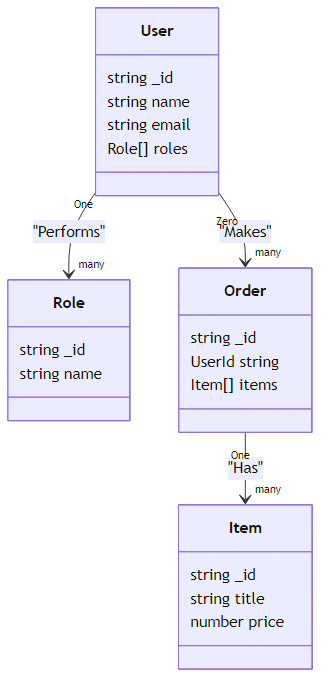

# UW330BPresentation
UW 300B JavaScript Presentation

Use Mermaid to create diagrams to document your project


1. **Install Node.js**:
   - Download and install Node.js from the [official website](https://nodejs.org/). or from [nvm (NodeVersionManager)](https://github.com/nvm-sh/nvm) (recommended)
   - During installation, ensure the option to install npm is selected.
   - Validate the install
   ```bash
    node -v
    npm -v
    nvm -v
    ``` 

2. **Install Mermaid CLI**:
   - Open a terminal (Mac Terminal, Git Bash).
   - Run the following command to install Mermaid globally:
     ```bash
     npm install -g @mermaid-js/mermaid-cli
     ```

3. **Verify Installation**:
   - After installation, verify that Mermaid CLI is installed by running:
     ```bash
     mmdc --version
     mmdc -h
     ```
   - This should display the help information for the Mermaid CLI.

4. **Optional: Add Mermaid to PATH**:
   - If the `mmdc` command is not recognized, ensure that the global npm directory is added to your system's PATH. You can find the global npm directory by running:
     ```bash
     npm config get prefix
     ```
   - Add the `bin` folder inside this directory to your PATH environment variable.
     - i.e. .../.nvm/versions/node/v22.14.0/bin

5. **Create .mmd files**
    - Copy/Paste to ClassDiagramExample.mmd
   ```mmd
    classDiagram
    class User {
        string _id
        string name
        string email
        Role[] roles
    }
    class Role {
        string _id
        string name
    }
    User "One" --> "many" Role : "Performs"
    class Order {
        string _id
        UserId string
        Item[] items
    }
    class Item {
        string _id
        string title
        number price
    }
    Order "One" --> "many" Item : "Has"
    User "Zero" --> "many" Order : "Makes"
   ```
6. **Use Mermaid CLI to generate diagrams from `.mmd` files**:
- Generally: ```mmdc -i input.mmd -o output.png```
- In this case:
```bash
mmdc -i ClassDiagram.mmd -o ClassDiagram.png
```
<details>
<summary>creates ClassDiagram.png</summary>

</details>
7. **Optional: Use JetBrains WebStorm with the Mermaid plugin**
- [JetBrains Webstorm](https://www.jetbrains.com/webstorm/)

<details>
<summary>- Install the Mermaid Plugin</summary>
- [View JetBrains WebStorm Mermaid Plugin](images/repo/JetBrainsWebStormMermaidPlugin.png)
</details>

